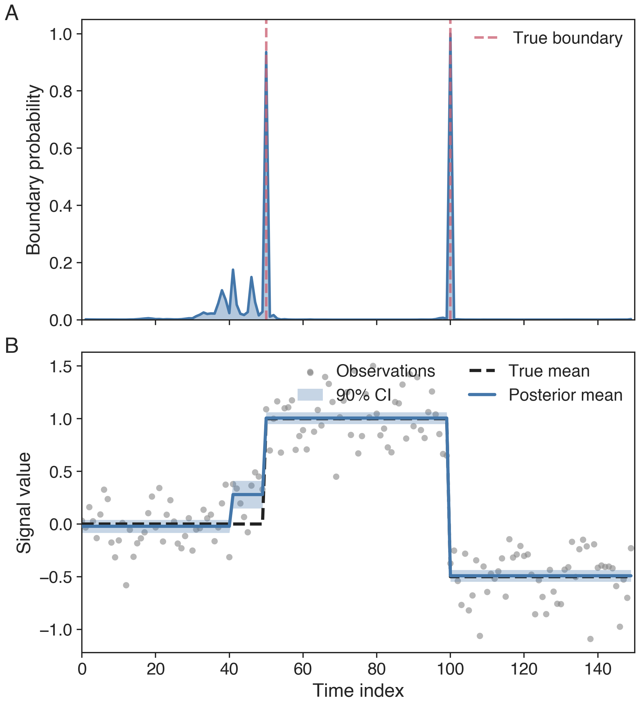
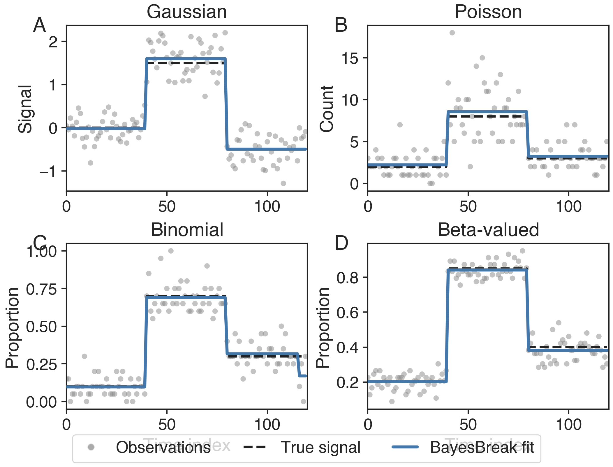
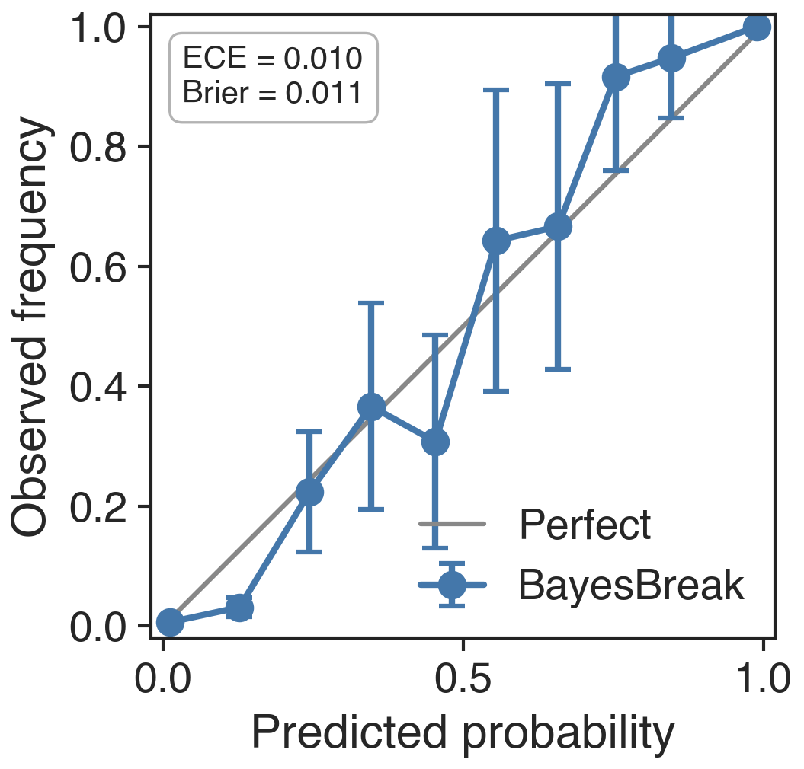
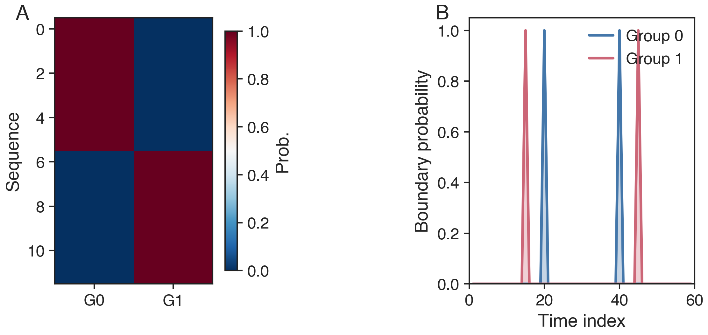
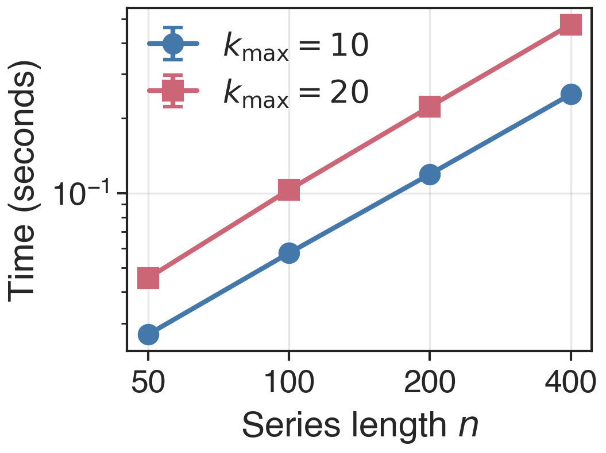
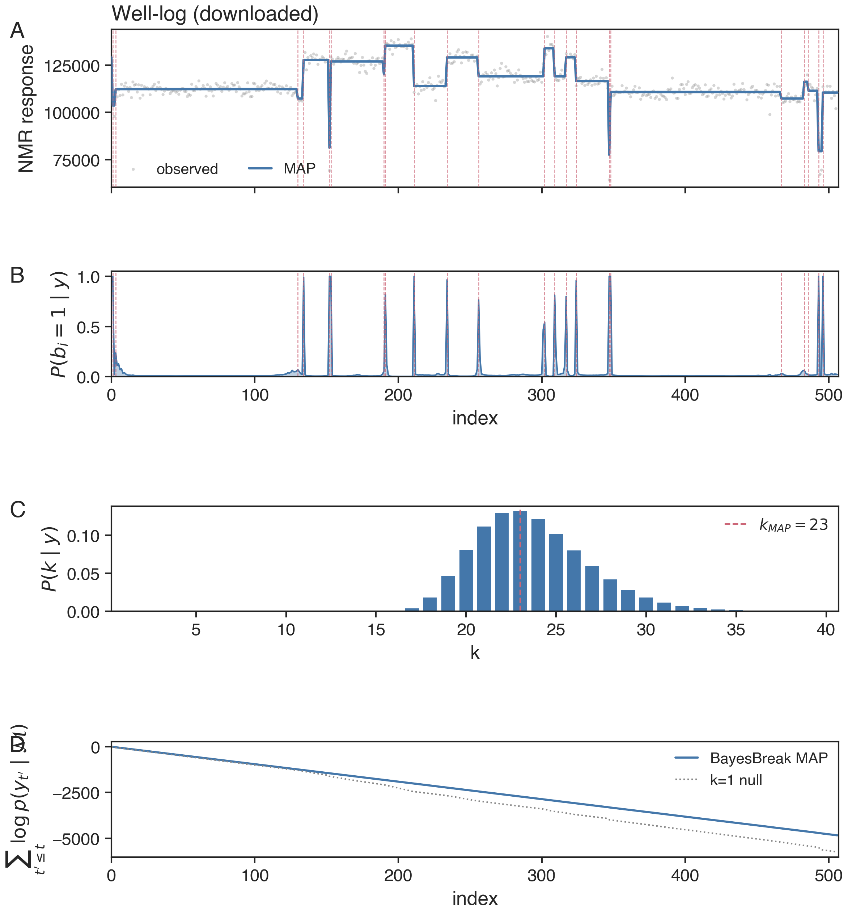
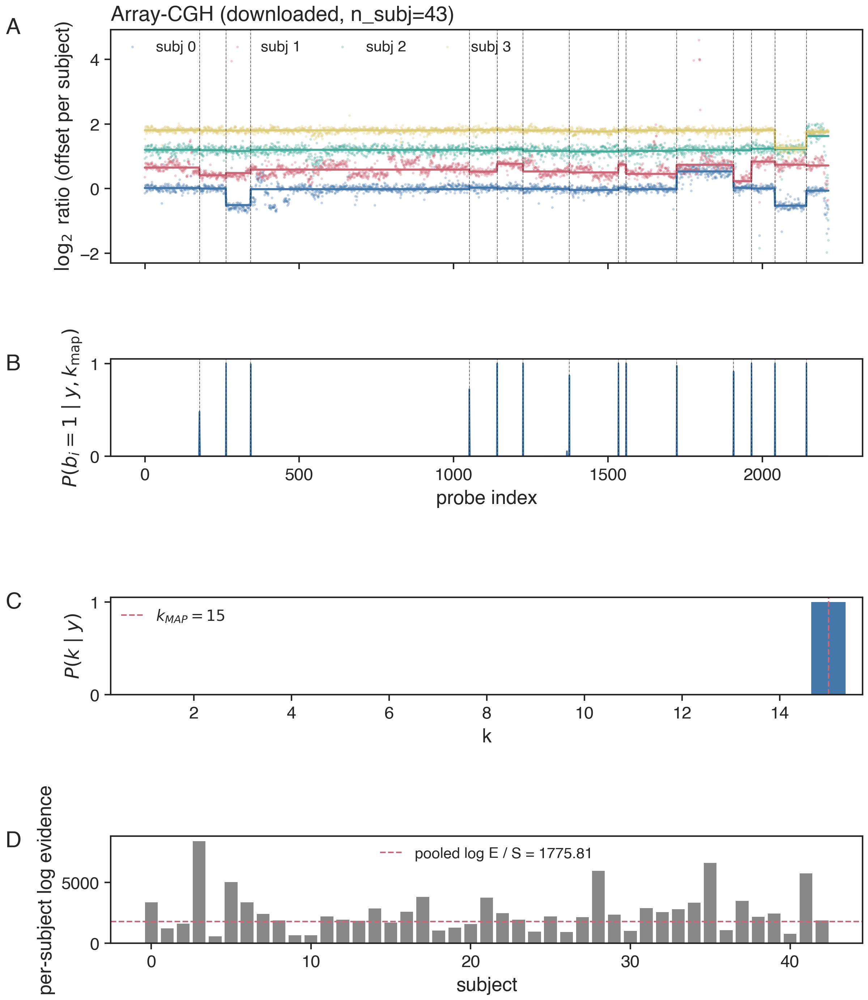
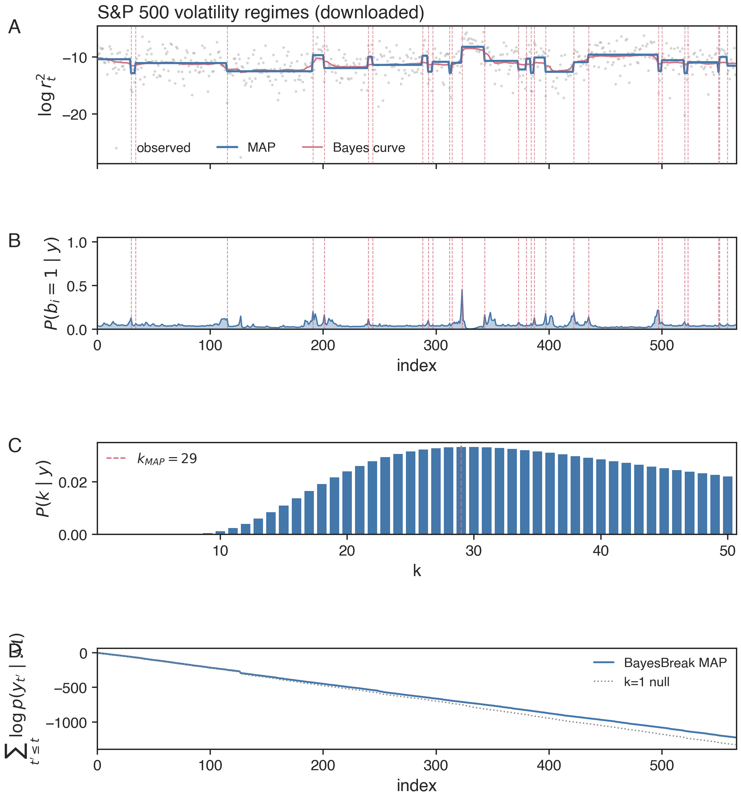
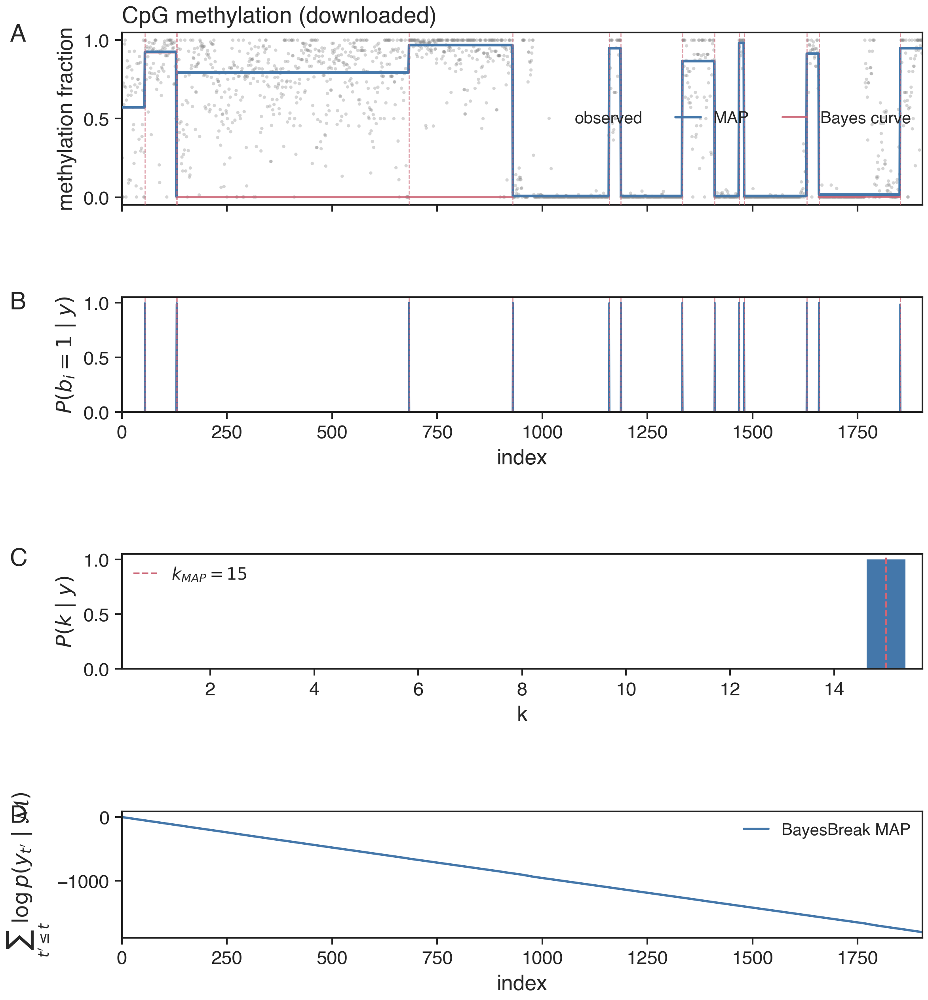

# Results

The figures and numbers below are reproduced verbatim from §6 of the
manuscript. They split cleanly into:

1. **Completed synthetic suite** (fig1–fig5, table1–table4): bundled archived
   runs that validate the framework's correctness and scaling.
2. **Completed real-data fits** (fig6–fig9): BayesBreak segmentations on
   four public datasets — well-log NMR geology, Coriell array-CGH, S&P 500
   volatility regimes, and CpG-atlas methylation.
3. **Quantitative result tables** (`tab:real_*`): partially populated from
   the same archived fits as the figures, with cells reserved for the
   planned external-comparator runs (PELT, WBS, SMUCE, RJMCMC, Fearnhead's
   exact DP).

## Synthetic suite

### Single-sequence Gaussian recovery



Top: marginal posterior probability that each interior index is a
boundary, with dashed verticals marking the truth. Bottom: observed
data, true latent mean, exported joint MAP segmentation, and 90%
segment-level posterior intervals. Joint-MAP boundaries align with the
high-mass marginal modes by construction
(`thm:dp-correctness`).

### Likelihood-family portability



Four panels exercising the conjugate closed-form blocks (Gaussian,
Poisson, Binomial) plus the one-dimensional Gauss–Legendre quadrature
block for Beta-response data. The DP layer is identical across panels;
only the per-block routine changes (`prop:gaussian-block` /
`prop:poisson-block` / `prop:binomial-block` / `prop:beta-block`).

### Boundary-posterior calibration



Empirical fraction of recovered boundaries vs predicted posterior
probability, binned across repeated simulations under a tolerance window
of $\tau=2$ indices. The diagonal is the perfectly-calibrated reference.
Combined with the boundary-event identity
$\sum_i P(b_i\!=\!1\mid y, k) = k-1$, this is the manuscript's main
calibration evidence for the boundary marginals.

### Latent-template grouping



Two-template mixture recovery via the latent-template EM
(`thm:em-monotone`). Sequences from two ground-truth templates are
correctly clustered modulo the label-permutation indeterminacy
(`prop:latent-identifiability` + `ex:label-switch-counterexample`); the
canonical anchor (`canonical_permutation_`) makes label-level reporting
reproducible across restarts.

### Runtime scaling



Empirical runtime vs sequence length for two values of $k_{\max}$. The
growth is smooth and predictable across the archived range
$n\in\{50, 100, 200, 400\}$, consistent with the
$\mathcal{O}(k_{\max} n^2)$ DP cost of `prop:bb-complexity`. For
$n\gtrsim 10^5$, switch to `SlidingWindowSegmenter` — see the
[large-$n$ tutorial](tutorials/06_sliding_window.ipynb).

## Real-data case studies

### 1. Well-log NMR geology — Gaussian block



BayesBreak segmentation on the 4050-point NMR well-log series at
stride-8 ($n=507$). Top: standardized response with joint MAP overlay;
bottom: marginal boundary posterior; right: $P(k\mid y)$ and cumulative
log-evidence vs the $k\!=\!1$ null.

**Headline numbers** (from the archived fit):

| Configuration | $\widehat k$ | MAP log-evidence | Runtime |
|---|---:|---:|---:|
| Index-uniform prior, $g\equiv 1$ | **23** | **−4989.28** | — |
| Length-aware prior, $g(\ell)\propto\ell$ | **25** | **−4997.15** | **1.91 s** |

The two priors agree on segment count to within ±2, with the length-aware
prior placing slightly more boundary mass in the long-segment regime.

### 2. Coriell array-CGH — shared-boundary multi-subject Gaussian



Pooled fit across $S=43$ Coriell cell-line profiles
($n_{\mathrm{probes}}=2215$). Top: four representative profiles offset
for visibility; bottom: pooled marginal boundary posterior; right:
$P(k\mid y)$ and per-subject log-evidence relative to the pooled mean.

| Strategy | Pooled log-evidence | $\widehat k$ |
|---|---:|---:|
| Independent per-subject (no pooling) | **109 617.7** | — |
| Shared boundaries, subject-specific $\mu$ | **76 359.8** | **15** |

The independent sum is naturally larger because each subject's
segmentation is integrated independently. The shared-boundary pooled fit
recovers $\widehat k=15$ shared changepoints.

### 3. S&P 500 volatility regimes — Gaussian on log $r_t^2$



Daily $\log r_t^2$ from 2015–2023 at stride-4 ($n=566$). MAP boundaries
cluster around the March-2020 COVID-19 shock and the February-2022
regime shift annotated by the dashed vertical references.

| Block model | $\widehat k$ | Log evidence |
|---|---:|---:|
| Gaussian on $\log r_t^2$ | **29** | **−1296.65** |
| Bernoulli on threshold crossings (95th pct) | **50** | **−114.41** |

The Bernoulli-on-crossings secondary specification reaches a higher
segment count but a less-interpretable interpretation on the original
return scale; the Gaussian specification is the primary result.

### 4. CpG-atlas methylation — Beta-response with per-CpG precision



`methylKit` chr21 test region ($n=1904$ CpGs). Top: per-CpG $\beta$
values coloured by local read coverage $\phi_t$; bottom: marginal
boundary posterior. The Bayes curve transitions between low and high
methylation plateaus aligned with the annotated reference markers.

| Region / cell type | $\widehat k$ | Historical predictive record |
|---|---:|---:|
| chr21 *methylKit* test region | **15** | `-387.50` (`RES-BB-RD-007Q`, excluded) |

The segmentation is a real result. The archived held-out computation is also real, but
it is excluded from posterior-predictive conclusions because it used a Gaussian
predictive calculation for Beta observations and an implicit endpoint rule. It is shown
only as historical provenance and must not be interpreted as a valid predictive score.

## Reproducing these numbers

The values above are stored in
[`report/shared/figures/results/realdata_metrics.json`](https://github.com/osolari/bayesbreak/blob/main/report/shared/figures/results/realdata_metrics.json).
This archived file is read-only. New executions are written to `results/` with new result
identifiers and provenance. The current generation entry point is

```bash
PYTHONPATH=src python scripts/tables/realdata_tables.py
```

The figures are regenerated by the corresponding scripts under
[`scripts/figures/`](https://github.com/osolari/bayesbreak/tree/main/scripts/figures).
See [Reproducibility](reproducibility.md) for the full pipeline.

## External baselines on the cached fits

Running the pure-Python baselines via `bayesbreak.baselines` on the
cached real-data fits at the same `k` target as each BayesBreak
$\widehat k$ when the algorithm requires one. F1@3 is an agreement diagnostic
at a 3-index tolerance window measured against BayesBreak's MAP boundaries; it
is not independent ground-truth accuracy. Numbers are archived in
`report/shared/figures/results/baselines_metrics.json`.

| Dataset | PELT | OP@$\widehat k$ | BS@$\widehat k$ | WBS@$\widehat k$ | Fearnhead-2006 ref |
|---|---:|---:|---:|---:|---:|
| Well-log NMR ($n=507$, BB $\widehat k=23$) | F1@3 $=0.18$ | $\mathbf{0.91}$ | $0.86$ | $0.05$ | $\mathbf{0.93}$ |
| S&P 500 ($n=566$, BB $\widehat k=29$) | $0.53$ | $\mathbf{0.82}$ | $0.43$ | $0.07$ | $0.55$ |
| Methylation ($n=1904$, BB $\widehat k=15$) | $0.44$ | $\mathbf{0.79}$ | $0.57$ | $0.14$ | n/a* |

\* The Fearnhead-2006 reference DP is omitted at $n>1200$ for the local
memory budget; runs on the smaller datasets.

CGH is not in the table: the cached fit stores the
`SharedBoundaryReplicatesSegmenter` pooled output but not the raw
$2215\times 43$ log$_2$-ratio matrix, and the single-trace ruptures
baselines on a pooled-mean curve are not informative. The CGH baseline
sweep is the next benchmarking pass.

R-backed baselines (CBS via `DNAcopy`, SMUCE via `stepR`, RJMCMC via
`mcp`) are skipped here because their upstream R packages are not
installed on the build machine; the wrapper interface is in place — see
[Baselines](baselines.md) for the install hints.

## What's planned

The four `tab:real_*` tables in §6 still have `---` cells in the columns
that require external annotations:

- **Boundary F1 / MAE for array-CGH** — pending Snijders-2001 annotation
  load.
- **ECE for well-log** — pending verified reference boundaries.
- **Atlas F1 for methylation** — pending Loyfer-2023 atlas pipeline (GEO
  `GSE186458` + `nloyfer/wgbs_tools` / `nloyfer/UXM_deconv`).

External-baseline runs (PELT, WBS, SMUCE, RJMCMC, Fearnhead's exact DP)
are now available via [`bayesbreak.baselines`](baselines.md) — populating
the comparator columns of these tables is the next iteration's
benchmarking pass.
